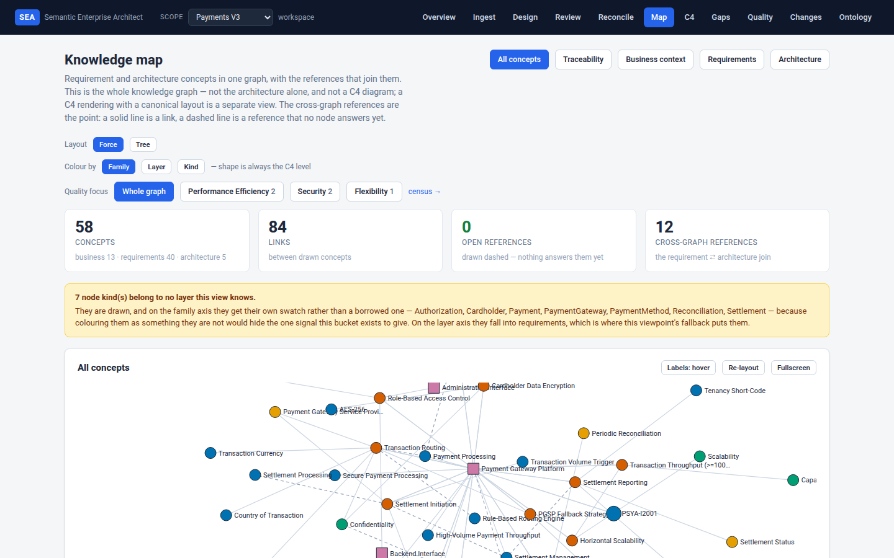
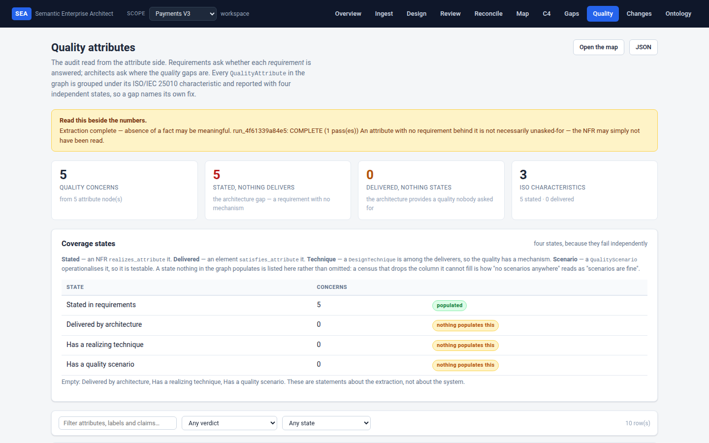
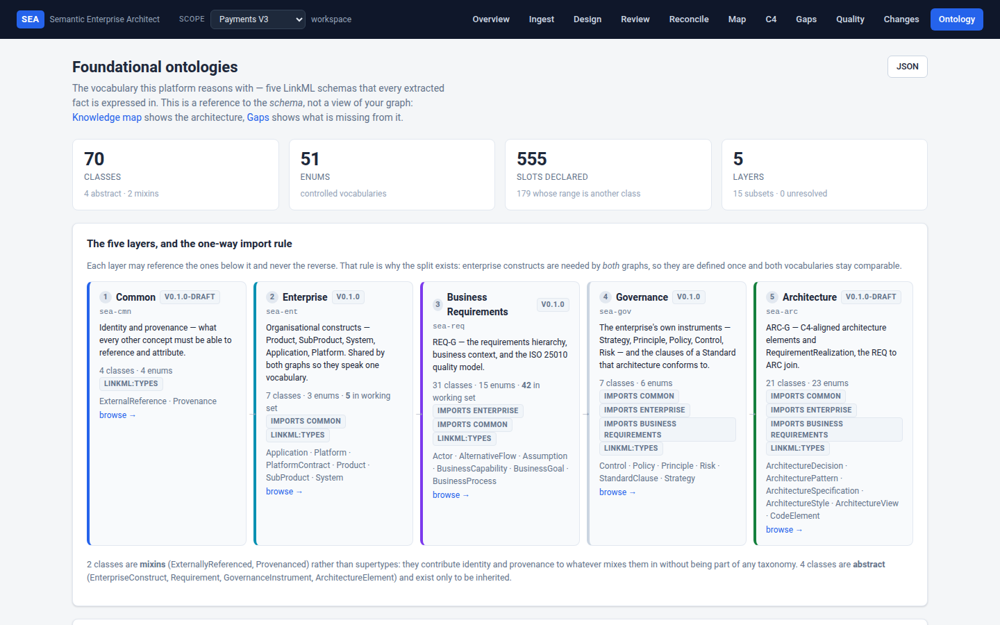
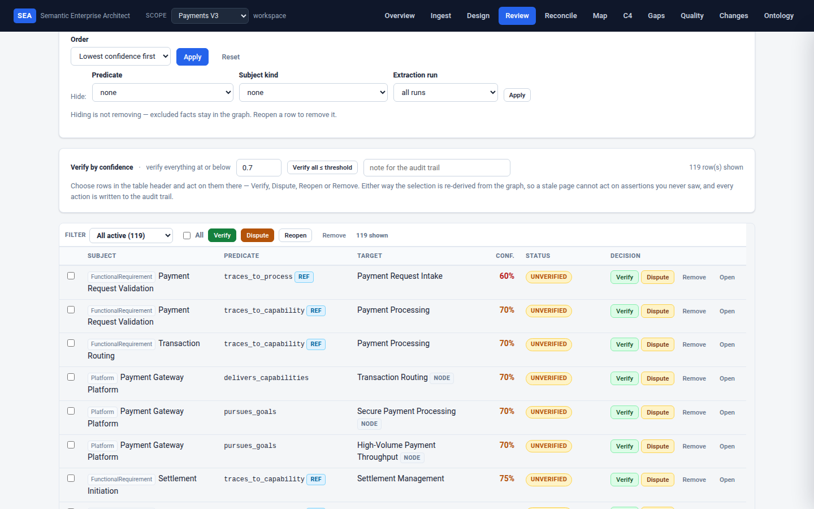

# SEA Platform

A platform shrunk to a tool and an app, to prove one idea: that an **ontology** can
carry system-architecture reasoning, validation and evolution across an enterprise.

Requirements are extracted from documents, held as a graph under human review, joined
to architecture through shared vocabulary, frozen into baselines a human accepted, and
extended by a Design Assistant that proposes — never writes. Agent assertions carry
their provenance — run, pass, model, domain pack — and the source text when one was
quoted; every fact a human vouches for leaves a decision behind.

The full intent is in the [PRD](docs/yeah_blueprint_PRD_v0_1.md); the state of the
build and what is deliberately deferred is in [TODO.md](TODO.md), [ISSUES.md](ISSUES.md)
and [docs/decisions/](docs/decisions/).

---

## The loop

The review gate's stages, as implemented ([projection, review and change
management](docs/ui-review-workflow.md)):

```
INGEST ──▶ REVIEW ──▶ RECONCILE ──▶ COMMIT ──▶ FREEZE ──▶ AUDIT
```

- **Two graphs, one vocabulary.** REQ-G holds requirements; ARC-G holds architecture.
  `implements_requirement` and its neighbours are the join, so a requirement that no
  architecture answers is a query, not a reading exercise.
- **Review is a gate, not a formality.** Extraction proposes; a human verifies,
  disputes, corrects, retires. `promote_to_baseline` moves only what review has
  accepted into `SYSTEM_BASELINE`, and leaves the rest behind.
- **Scopes keep identity honest.** A scope is one system — the unit of graph, baseline
  and review. Node identity is the label, so without that boundary two systems that
  each contain a "Database" would collapse into one node ([core/workspace.py](core/workspace.py)).
- **A design extends what was accepted.** The Design Assistant reads REQ-G plus the
  baseline, drafts an ARC-G proposal, and a human applies or discards it. A baseline
  is a frozen revision when one exists, otherwise the promoted baseline.

---

## Requirements

- Python 3.10+ (3.11 is what the suite runs on)
- [`uv`](https://docs.astral.sh/uv/) for dependencies, scripts and running the app
- An LLM endpoint and key — a hosted provider, or a local server through
  `OPENAI_BASE_URL` (see [.env.example](.env.example))

## Install

```bash
uv sync --extra dev          # runtime deps + the dev extra (pytest, ruff, mypy)
cp .env.example .env         # then add your API key(s)
```

Optional extras, only if you need them: `--extra sor-sql` (SQLAlchemy Core for the
SQLite/PostgreSQL store), `--extra sor-postgres`, `--extra valkey` (the run journal).

## Run the app

```bash
uv run sea-app               # http://127.0.0.1:5000
```

`SEA_HOST`, `SEA_PORT` and `SEA_DEBUG` are read from the environment, so the same
entry point serves a local session and a container. Background work needs a worker and
a SQLite-backed scope:

```bash
uv run sea-worker            # poll forever
uv run sea-worker --once     # drain what is queued, then exit
```

The pages, in the order a newcomer meets them:

| Page | What it answers |
|---|---|
| `/` | What the tool is, and the journey it implements |
| `/workspace` | Which systems this workspace holds, and which one you are looking at |
| `/ingest` | Put a document in; see what the run cost and what it could not extract |
| `/review` | Verify, dispute, correct or retire each fact — with its source text |
| `/reconcile` | Bind a reference to the node it means, or report it unresolved |
| `/changes` | Commit, freeze and promote; every decision in the audit trail |
| `/changes/diff` | Any two states side by side |
| `/design` | Draft an architecture proposal from REQ-G + the baseline, then apply or discard |
| `/gaps` | Requirements with no architectural answer, both directions |
| `/quality` | Quality attributes: stated and delivered, gaps and unasked |
| `/map` | The whole graph as one diagram, with lenses |
| `/c4` | The C4 specification view, and its notation as a download |
| `/ontology` | The vocabulary itself, browsable and searchable |
| `/runs/<job_id>` | A background run: passes, progress and verdict |

`/graph` survives as an alias redirecting to `/map` — deliberately without a permanent
redirect header, so the name stays reclaimable by a later view.

JSON APIs sit alongside the pages (`/api/gaps`, `/api/quality`, `/api/map`, `/api/c4`,
`/api/realization`, `/api/ontology`, `/api/reconcile`, `/api/design`, `/api/workspace`,
`/api/runs/<run_id>/stream`), and the graph exports as `/export/graph.json` and
`/export/graph.ttl`.

## What it looks like

Four pages of the `payments_v3` scope — a requirements ingest of
[`test_data/prd/sample_requirements.md`](test_data/prd/sample_requirements.md) under the
`payment_processing` domain pack. Click any image for the full size;
`scripts/capture_screenshots.py` regenerates them against a running app, so they can be
refreshed in one command rather than drifting.

| | |
|---|---|
| [](docs/images/map.png)<br>**`/map`** — the whole graph in one drawing. Solid lines are links the graph holds, dashed ones are references no node answers yet, and the notice names the node kinds no layer claims. | [](docs/images/quality.png)<br>**`/quality`** — every quality attribute under its ISO 25010 characteristic, in the four coverage states. A column nothing populates says so rather than being dropped. |
| [](docs/images/ontology.png)<br>**`/ontology`** — the schema itself: five layers and the one-way import rule, with what each vocabulary is for and where it stops. | [](docs/images/review.png)<br>**`/review`** — every fact with its source, confidence and review state. `REF` marks a cross-graph reference, `NODE` a bound one, and nothing enters a baseline unverified. |

## Command line

```bash
# Extract a document. --domain-pack grounds it in a business vocabulary.
uv run sea-agent run --agent knowledge_extraction \
    --input test_data/prd/sample_requirements.md \
    --output data/output/extraction.json \
    --domain-pack payment_processing

uv run sea-agent run --agent design_assistant --store-root data/sea   # reads a graph, not a file
uv run sea-agent list-agents
uv run sea-agent config --agent knowledge_extraction

uv run sea-eval evaluate --agent knowledge_extraction \
    --test-cases test_data/test_cases/knowledge_extraction_test_cases.json \
    --metrics answer_relevancy faithfulness
uv run sea-eval show-results --results data/output/evaluation_results.json
```

`sea-agent run --agent <name> --list-domain-packs` prints the packs in force —
`--list-domain-packs` is an option on `run`, so it still needs `--agent` alongside it.
For the Design Assistant the graph comes from `--store-root` rather than `--input`: its
input is a graph, not a document.

### Evaluations

`sea-eval` runs [DeepEval](https://docs.deepeval.com/) over a test-case file. The metrics
it knows:

| Metric | Reads as |
|---|---|
| `answer_relevancy` | Is the output relevant to what was asked |
| `faithfulness` | Is the output supported by the context it was given |
| `contextual_relevancy` | Was the supplied context the relevant context |
| `hallucination` | Did it assert something the context does not support |
| `bias`, `toxicity` | Language checks |

The framework's own default is `answer_relevancy`, `faithfulness` and
`contextual_relevancy` at a 0.7 pass threshold; the CLI defaults to the first two.
Results land in `data/output/evaluation_results.json` unless `--output` says otherwise.

## Repository layout

```
yeah_blueprint/
├── agents/                    # The five PRD agent profiles, plus the shared extraction core
│   ├── base_agent.py cli.py   # SEABaseAgent; the `sea-agent` CLI
│   ├── extraction/            # pass runner, chunking, merging, validators, progress
│   ├── knowledge_extraction/  # documents -> REQ-G
│   ├── architecture_extraction/  # documents -> ARC-G
│   ├── design_assistant/      # proposes an ARC-G draft; writes nothing
│   ├── ontology_engineer/  domain_context/  semantic_auditor/
├── app/                       # MVP web app (Flask)
│   ├── __init__.py            # create_app and the routes
│   ├── projections.py         # gap, quality and realization reports
│   ├── runner.py              # one execution path, shared by the request and the worker
│   ├── worker.py              # `sea-worker`: claims and runs background jobs
│   ├── viewpoints/            # C4 and merged-map rendering
│   ├── ontology_reference.py  templates/  static/
├── core/                      # Shared domain layer — must not import agents/ or app/
│   ├── knowledge/             # the canonical graph: model, ingest, review, reconcile,
│   │                          #   realization, digest, drafts, store (SQLite / file), rdf
│   ├── workspace.py           # workspaces, scopes and store addressing
│   ├── ontology.py patterns.py quality.py jobs.py events.py artifacts.py
├── ontology/                  # LinkML schemas — see ontology/README.md
│   ├── sea_common.yaml enterprise_structure.yaml requirements_base.yaml
│   ├── architecture_base.yaml governance_base.yaml
│   ├── domains/               # domain packs (payment_processing)
│   └── catalogues/            # the architecture pattern library
├── evaluation/                # DeepEval harness — the `sea-eval` CLI
├── config/                    # agent_config.py + optional per-agent YAML overrides
├── scripts/                   # test_report.py, todo.py, sanity_check.py, benches,
│                              #   capture_screenshots.py
├── tests/                     # pytest suite, grouped by the question it answers
├── test_data/                 # tracked INPUT fixtures: prd/, arch/, test_cases/
├── data/                      # runtime output (gitignored)
├── reports/                   # generated test reports (gitignored)
├── docs/                      # PRD, design notes, decisions (ADRs), todos,
│                              #   images/ (the README screenshots)
├── run.py                     # the `sea-app` entry point
├── AGENTS.md                  # the conventions this repo is held to
├── CONTRIBUTING.md ISSUES.md TODO.md
└── LICENSE NOTICE THIRD-PARTY-NOTICES
```

## The knowledge layer

`core/knowledge/` is the system of record and the only thing both the agents and the
app agree on.

- **The graph is the canonical form.** Nodes carry a kind and a label; assertions carry
  provenance (run, pass, model, domain pack) and a scope. Content-addressed identity
  and typed identifiers are what make a join safe rather than confident.
- **Review state travels with every fact.** `UNVERIFIED`, `VERIFIED`, `CORRECTED`,
  `DISPUTED`, `SUPERSEDED`, `RETIRED` — and removing a fact retires it rather than
  erasing it, so the audit trail can still explain the past.
- **Revisions are immutable; the working set is not.** Commit takes a snapshot, freeze
  makes it a baseline, and any two states can be diffed.
- **Backends are per scope.** A file store and a SQLite store sit behind one interface;
  only the concurrency-safe one can run guarded writes, which is why background work
  requires SQLite (see [system of record](docs/design/system-of-record.md)).

## Ontology

The vocabulary is authored in [LinkML](https://linkml.io/) and is what extraction is
held to:

| Schema | Holds |
|---|---|
| `sea_common.yaml` | Provenance and external identifier references, shared by every layer |
| `enterprise_structure.yaml` | Product, System, Application, Platform and their topology |
| `requirements_base.yaml` | The requirement hierarchy, ISO/IEC 25010 quality model, traceability |
| `architecture_base.yaml` | C4-aligned architecture: containers, components, connections |
| `governance_base.yaml` | Strategy, principle, policy, control, risk |
| `domains/payment_processing.yaml` | A domain pack: the vocabulary one business is stated in |
| `catalogues/architecture_patterns.yaml` | Known solutions the Design Assistant chooses from |

[ontology/README.md](ontology/README.md) documents the model; `uv run sea-agent run
--agent <name> --list-domain-packs` lists the packs in force.

## Tests

```bash
.venv/bin/python -m pytest tests/ -q            # the suite
.venv/bin/python scripts/test_report.py --catalog   # every area, file and test, in ~0.1s
.venv/bin/python scripts/test_report.py -n 4        # the full run, and it writes reports/
```

The suite is grouped by **the question each file answers**, not by directory, and every
`tests/test_*.py` belongs to exactly one area in
[scripts/test_report.py](scripts/test_report.py) — `tests/test_test_report.py` fails
until a new file is assigned. Every test states its intent in a docstring. Read
[Reading the tests](docs/testing.md) before adding one.

A full regression ends by generating `reports/` — the reports are gitignored, so
nothing fails when they are late, which is exactly why it is a step to perform rather
than hope for.

## Configuration

Agent configuration is resolved in this order: `config/<agent>.yaml` if it exists, else
the defaults in code ([config/agent_config.py](config/agent_config.py)). Only
`knowledge_extraction.yaml` overrides anything today; the other four agents run on their
defaults, which is deliberate — a YAML file per agent that restates the defaults is a
second place to be wrong.

[.env.example](.env.example) documents every environment variable: provider keys and
base URLs, the default model and provider, `ONTOLOGY_PATH`, `SEA_DATA_DIR`,
`SEA_DOMAIN_PACK`, `SEA_INITIATIVE` and logging.

[workspace.yaml.example](workspace.yaml.example) documents the workspace manifest. A
directory with no `workspace.yaml` is already a valid workspace with one scope; the
manifest is only needed to declare **more than one system**, or a SQLite-backed scope,
which is what background work requires.

## Project records

This repository keeps its own history in more than commits, and each has one home:

- [AGENTS.md](AGENTS.md) — the conventions the code is held to. It takes precedence over
  this file.
- [CONTRIBUTING.md](CONTRIBUTING.md) — licensing of contributions, the DCO sign-off, and
  the conventions a pull request has to satisfy.
- [ISSUES.md](ISSUES.md) — measured observations about the current state. An issue is a
  fact somebody measured; a decision is not one.
- [TODO.md](TODO.md) — the generated index of `docs/todos/entries/`. Never edit it by
  hand: `uv run scripts/todo.py render`, and `check` to validate.
- [docs/decisions/](docs/decisions/) — closed work, one ADR per former TODO entry.
- [docs/design/](docs/design/) — the long analysis, including evaluated alternatives.

## Documentation

- [PRD](docs/yeah_blueprint_PRD_v0_1.md) — what this is meant to be
- [Reading the tests](docs/testing.md) — areas, intent and the extraction harness
- [Review gate](docs/ui-review-workflow.md) — projection, review and change management
- [User journey](docs/user-journey.md) — the intended path through the tool
- [Living-system architecture](docs/living-system-architecture.md) — why baselines and
  promotion work the way they do
- [The Design Assistant](docs/design/design-assistant.md) — proposing a core
  architecture from REQ-G
- [System of record](docs/design/system-of-record.md) — the store concurrent architects edit
- [Workspace structure](docs/design/workspace-structure.md) — many systems per workspace
- [Strands integration](docs/strands-integration.md) — how the agents use the SDK
- [Architecture review](docs/architecture-review.md) — an earlier review, predating the
  user journey, and possibly deviated from

## License

Licensed under the Apache License, Version 2.0. See [LICENSE](LICENSE) for the full
text, [NOTICE](NOTICE) for attribution, and [THIRD-PARTY-NOTICES](THIRD-PARTY-NOTICES)
for the components vendored into the web UI.

Copyright 2025 SEA Platform Team.

Contributions are accepted under the same license, with a DCO sign-off on every
commit — see [CONTRIBUTING.md](CONTRIBUTING.md).
