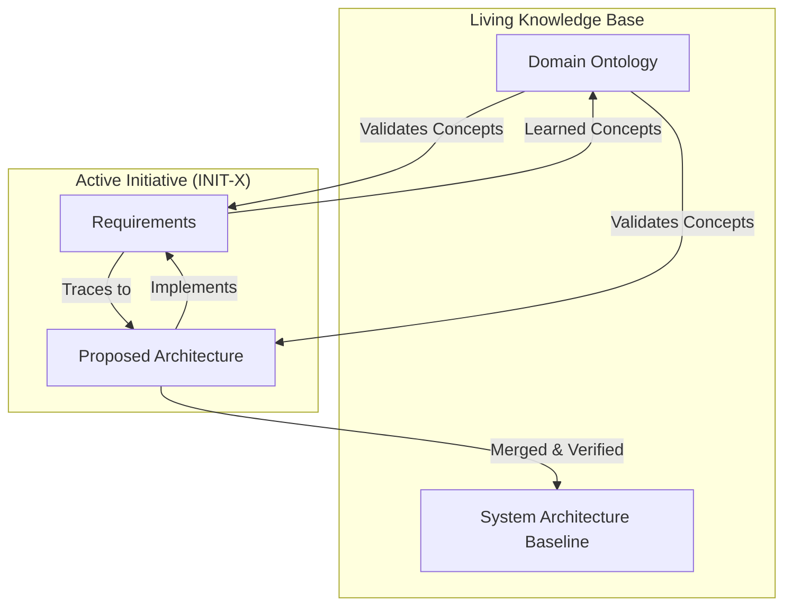

# The Living System Architecture

## Overview

The SEA (Semantic Enterprise Architecture) Platform is not a static analysis tool; it is a **System Memory** for the enterprise. It models the organization not as a snapshot in time, but as a living, evolving entity where **Initiatives** drive change against a **Persistent Baseline**, all grounded in a **Growing Domain Ontology**.

## The Three Layers of Persistence

### 1. The Initiative Layer (Transient / Project-based)
*   **The "Why" and "When":** Represents specific business goals, funding, and discrete projects (e.g., `INIT-2024-001: Payment Modernisation`).
*   **Lifecycle:** Proposed → Active → Completed.
*   **Role in SEA:** Initiatives act as "feature branches" of the architecture. They contain the *proposed* requirements and architectural changes. When an Initiative is completed, its verified changes are merged into the System Baseline.

### 2. The System Architecture Layer (Persistent / Evolving)
*   **The "What":** The actual deployed reality of the enterprise—Containers, DataStores, External Systems, and their relationships.
*   **Lifecycle:** Born → Evolved (via Initiatives) → Retired.
*   **Role in SEA:** This is the **Baseline**. It represents the current state of the world. It persists across Initiatives and provides the context against which new proposals are audited for gaps and conflicts.

### 3. The Domain Ontology Layer (Persistent / Learning)
*   **The "Meaning":** The vocabulary of the business—concepts like `Payment`, `PAN`, `Merchant`, and `Chargeback`.
*   **Lifecycle:** Discovered → Refined → Standardized.
*   **Role in SEA:** This is the **Reference Frame**. It grows as we encounter new concepts in different Initiatives. It ensures that "Cardholder Data" in one project and "PAN" in another are recognized as related domain concepts, preventing semantic drift.

## The Reconciliation Flow

## Architectural Implications

1.  **Provenance is Mandatory:** Every fact in the graph must carry `scope` (Initiative vs. Baseline) and `initiative_id`. Without this, we cannot distinguish a plan from reality.
2.  **Merge Semantics:** The platform must support "merging" an Initiative into the Baseline. This involves promoting `INITIATIVE_PROPOSAL` assertions to `SYSTEM_BASELINE` status after human verification.
3.  **Incremental Learning:** The Domain Ontology is never "finished." Each extraction run should contribute to a shared, persistent domain vocabulary that improves the precision of future extractions.

## Why This Matters

Traditional architecture tools produce static diagrams that rot the moment they are saved. By modeling the enterprise as a **Living System**, SEA ensures that:
*   **History is preserved:** We know *why* a change was made (which Initiative).
*   **Context is maintained:** We know what is currently deployed (the Baseline).
*   **Knowledge compounds:** We get smarter about the domain with every project we process.
